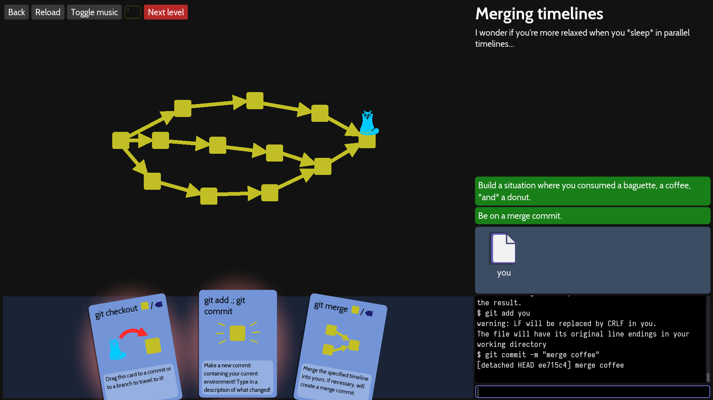

# Merge

## 1.Merging timelines

### git checkout : git brach와 같은 기능을 수행 하는 명령어로 원하는 브렌치로 이동한다. 

### git commit : 을 통해 변경된 내용을 커밋한다.

### git merge : 를 사용해 각각변경된 브렌치들을 하나로 통합한다.

## 2.Contradictions

### ###
